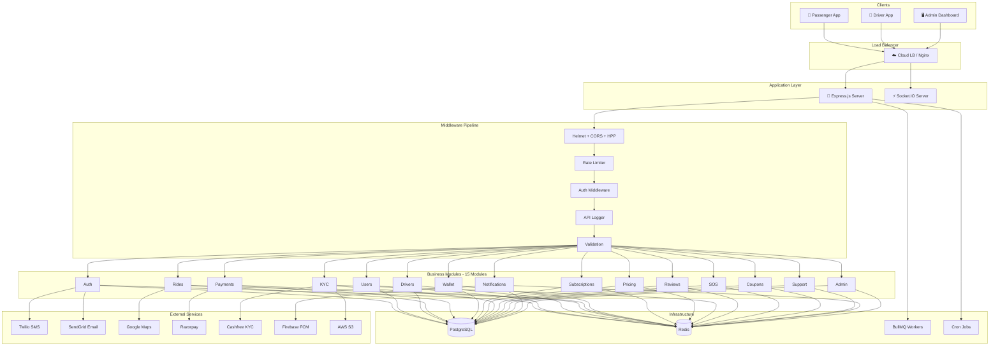
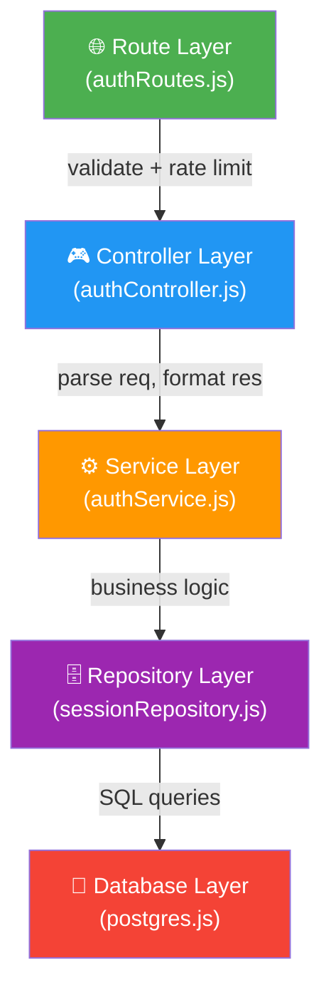
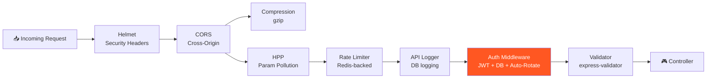
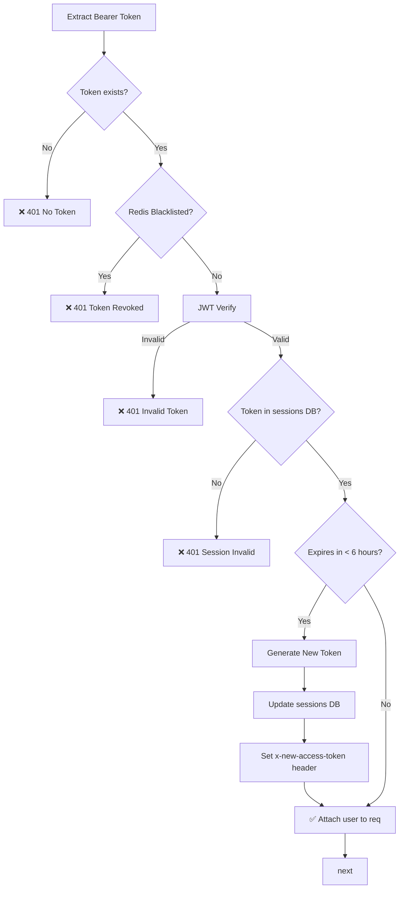
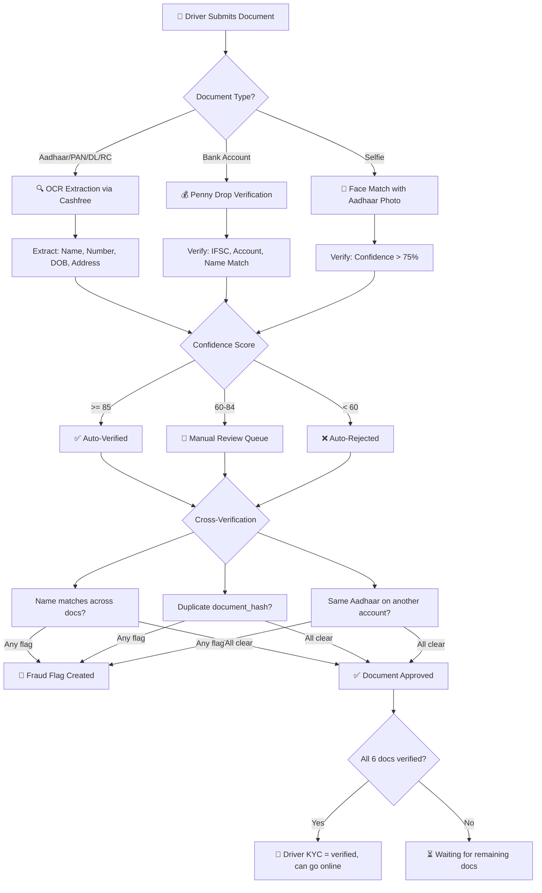
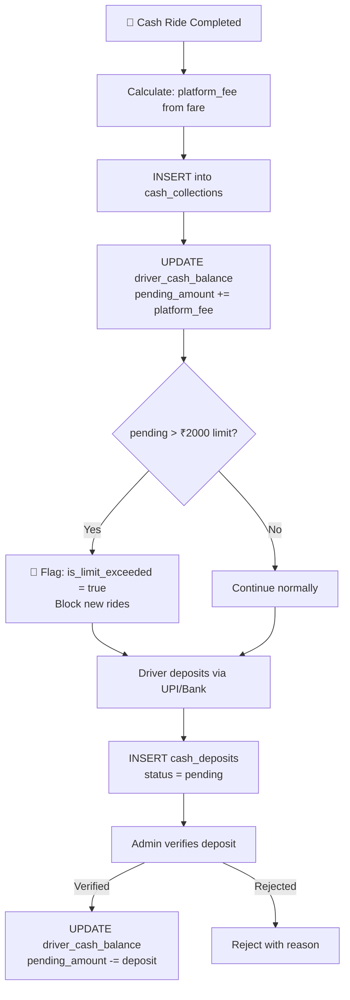
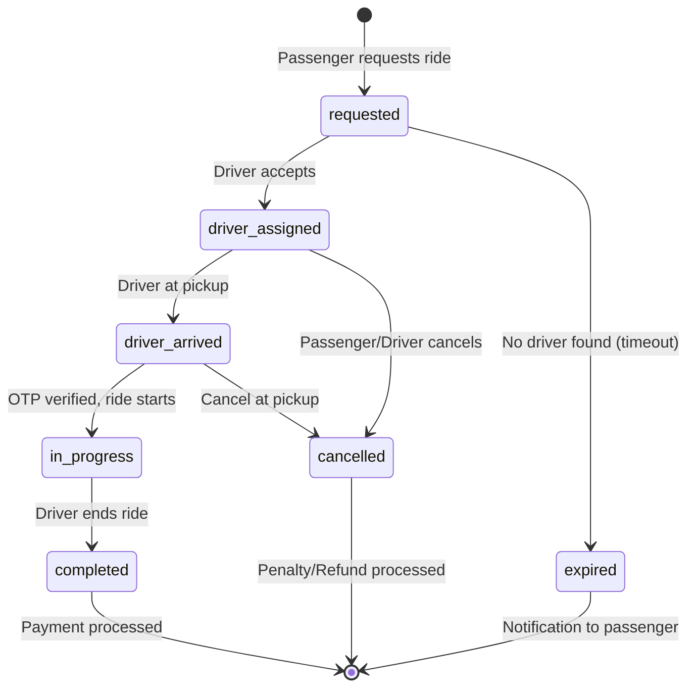

# 🏗️ GoMobility Backend — Complete Architecture Document

> **Version:** 1.0 | **Date:** May 2026 | **Stack:** Node.js + Express + PostgreSQL + Redis + Socket.IO  
> **Base URL:** `https://api.gomobility.co.in` | **API Prefix:** `/api/v1`

---

## 1. High-Level System Architecture



---

## 2. Layered Architecture (Per Module)

Every module follows a **strict 5-layer pattern**:



| Layer | Responsibility | Example |
|---|---|---|
| **Route** | HTTP method, path, middleware chain | `POST /auth/signin` → rateLimiter → validate → controller |
| **Controller** | Parse request, call service, format response | Extract `phone`, `otp` from `req.body` |
| **Service** | Business logic, orchestration | Verify OTP → Create User → Generate Token → Create Session |
| **Repository** | Raw SQL queries, data access | `INSERT INTO sessions ...` |
| **Database** | Connection pool, query execution | `pg.Pool` with connection pooling |

---

## 3. API Modules & Endpoints Overview

| # | Module | Route Prefix | Key Endpoints | Auth Required |
|---|---|---|---|---|
| 1 | **Auth** | `/auth` | signup, verify-signup, signin, verify-signin, logout, me | Mixed |
| 2 | **Users** | `/users` | profile CRUD, saved addresses, FCM token | ✅ |
| 3 | **Drivers** | `/drivers` | go-online/offline, location update, earnings, status | ✅ |
| 4 | **Rides** | `/rides` | request, accept, arrive, start, complete, cancel, history | ✅ |
| 5 | **Payments** | `/payments` | create-order, verify, refund, QR payments | ✅ |
| 6 | **Wallet** | `/wallet` | balance, recharge, transactions, withdraw | ✅ |
| 7 | **Subscriptions** | `/subscriptions` | plans, subscribe, cancel, status | ✅ |
| 8 | **Pricing** | `/pricing` | estimate fare, vehicle configs | Mixed |
| 9 | **KYC** | `/kyc` | submit document, status, admin review | ✅ |
| 10 | **Reviews** | `/reviews` | create review, get ratings | ✅ |
| 11 | **SOS** | `/sos` | trigger SOS, emergency contacts | ✅ |
| 12 | **Coupons** | `/coupons` | validate, apply, list available | ✅ |
| 13 | **Support** | `/support` | create ticket, messages, status | ✅ |
| 14 | **Notifications** | `/notifications` | list, mark read | ✅ |
| 15 | **Admin** | `/admin` | dashboard, user mgmt, pricing config | ✅ (admin) |

---

## 4. Middleware Pipeline



### Auth Middleware Flow (Post-Refactor)



---

## 5. Real-Time Layer — Socket.IO

```mermaid
graph TB
    subgraph "Socket.IO Server"
        AUTH_S[🔐 Auth via JWT Token]
        AUTH_S --> JOIN[Join Rooms:<br/>user:{id}, driver:{id}]
    end

    subgraph "Core Events"
        E1["auth:login → Driver goes online"]
        E2["location:update → GPS every 5s"]
        E3["ride:new-request → Push to nearby drivers"]
        E4["ride:accept → Driver accepts"]
        E5["ride:arrived → Driver at pickup"]
        E6["ride:started → Ride begins"]
        E7["ride:completed → Ride ends"]
        E8["ride:cancelled → Cancellation"]
    end

    subgraph "Supporting Events"
        E9["payment:collect-cash"]
        E10["payment:qr-generated"]
        E11["ride:driver-location → Live tracking"]
    end

    subgraph "Handlers"
        H1[socket.server.js<br/>Main event router]
        H2[assignment.handler.js<br/>Driver matching]
        H3[payment.handler.js<br/>Cash/QR flows]
        H4[reconnection.handler.js<br/>State recovery]
        H5[rideTracking.js<br/>Live GPS]
    end

    AUTH_S --> H1
    H1 --> E1 & E2 & E3 & E4 & E5 & E6 & E7 & E8
    H1 --> H2 & H3 & H4 & H5
```

---

## 6. Background Jobs & Cron

| Job | Type | Schedule | Purpose |
|---|---|---|---|
| **Scheduled Ride Trigger** | Cron | Every 1 min | Trigger ride requests 15 min before `pickup_time` |
| **API Log Cleanup** | Cron | Daily | Delete old API logs |
| **Session Cleanup** | Repository | On-demand | `DELETE FROM sessions WHERE expires_at <= NOW()` |
| **BullMQ Workers** | Queue | Continuous | Async job processing (notifications, emails) |

---

---

## 7. Entity-Relationship Diagram (Core)

```mermaid
erDiagram
    USERS ||--o{ SESSIONS : "has many"
    USERS ||--o| DRIVERS : "is a (if role=driver)"
    USERS ||--o| WALLETS : "has one"
    USERS ||--o{ RIDES : "requests as passenger"
    USERS ||--o{ REVIEWS : "writes/receives"
    USERS ||--o{ NOTIFICATIONS : "receives"
    USERS ||--o{ SAVED_ADDRESSES : "saves"
    USERS ||--o{ EMERGENCY_CONTACTS : "adds"
    USERS ||--o{ SUPPORT_TICKETS : "creates"
    USERS ||--o{ REFERRAL_CODES : "has one"
    USERS ||--o{ USER_SUBSCRIPTIONS : "subscribes"
    USERS ||--o{ KYC_DOCUMENTS : "submits"
    USERS ||--o| DRIVER_KYC_STATUS : "has one"
    USERS ||--o| RATING_SUMMARIES : "has one"

    DRIVERS ||--o{ RIDES : "assigned to"
    DRIVERS ||--o| DRIVER_SCORE : "has one"
    DRIVERS ||--o{ DRIVER_METRICS_DAILY : "tracked daily"
    DRIVERS ||--o| DRIVER_VEHICLE : "has one"
    DRIVERS ||--o{ DRIVER_PENALTIES : "receives"
    DRIVERS ||--o| DRIVER_PENALTY_SUMMARY : "has one"
    DRIVERS ||--o{ DRIVER_INCENTIVE_PROGRESS : "progresses"
    DRIVERS ||--o| DRIVER_CASH_BALANCE : "has one"
    DRIVERS ||--o{ CASH_DEPOSITS : "makes"
    DRIVERS ||--o{ CASH_COLLECTIONS : "collects"
    DRIVERS ||--o{ DRIVER_EARNINGS_WEEKLY : "aggregated"
    DRIVERS ||--o{ DRIVER_EARNINGS_MONTHLY : "aggregated"
    DRIVERS ||--o{ DRIVER_DESTINATION_MODE : "sets"
    DRIVERS ||--o{ RIDE_REJECTIONS : "rejects"

    RIDES ||--o| RIDE_CANCELLATIONS : "may be cancelled"
    RIDES ||--o{ RIDE_OTPS : "has verification OTP"
    RIDES ||--o| RIDE_INVOICES : "generates invoice"
    RIDES ||--o{ RIDE_REJECTIONS : "rejected by drivers"
    RIDES ||--o{ REVIEWS : "reviewed"
    RIDES ||--o{ TRANSACTIONS : "has payments"
    RIDES ||--o{ PAYMENT_ORDERS : "has payment orders"
    RIDES ||--o{ SOS_ALERTS : "may trigger SOS"
    RIDES ||--o{ COUPON_USAGES : "may use coupon"
    RIDES ||--o{ SUPPORT_TICKETS : "may have tickets"
    RIDES ||--o| SCHEDULED_RIDES : "may be scheduled"
    RIDES ||--o| CASH_COLLECTIONS : "cash collected"

    WALLETS ||--o{ TRANSACTIONS : "has many"

    SUBSCRIPTION_PLANS ||--o{ USER_SUBSCRIPTIONS : "chosen by users"
    COUPONS ||--o{ COUPON_USAGES : "used by"
    INCENTIVE_PLANS ||--o{ DRIVER_INCENTIVE_PROGRESS : "tracked"
    SUPPORT_TICKETS ||--o{ SUPPORT_MESSAGES : "has conversation"
    KYC_DOCUMENTS ||--o{ KYC_FRAUD_FLAGS : "may be flagged"
```



---

## 8. All Tables — Detailed Schema

### 8.1 Core User & Auth Tables

#### `users` — Central User Table
| Column | Type | Constraints | Notes |
|---|---|---|---|
| `id` | UUID | **PK**, default `uuid_generate_v4()` | Primary identifier |
| `phone_number` | VARCHAR(15) | NOT NULL | Indian 10-digit |
| `email` | VARCHAR(255) | | Optional |
| `full_name` | VARCHAR(100) | | |
| `profile_picture` | TEXT | | S3 URL |
| `role` | VARCHAR(20) | NOT NULL, CHECK `(passenger,driver,admin)` | Multi-role via separate rows |
| `is_verified` | BOOLEAN | DEFAULT FALSE | OTP verified |
| `is_active` | BOOLEAN | DEFAULT TRUE | Soft deactivation |
| `fcm_token` | TEXT | | Firebase push token |
| `last_login` | TIMESTAMP | | |
| `created_at` | TIMESTAMP | | |
| `updated_at` | TIMESTAMP | | |

**Unique:** `(phone_number, role)`, `(email, role)`  
**Indexes:** `phone_number`, `role`, `is_verified`

---

#### `sessions` — Auth Sessions (Access Token Only)
| Column | Type | Constraints | Notes |
|---|---|---|---|
| `id` | SERIAL | **PK** | |
| `user_id` | UUID | **FK → users(id)** CASCADE | |
| `access_token` | TEXT | UNIQUE, NOT NULL | JWT access token |
| `device_id` | VARCHAR(255) | | |
| `device_type` | VARCHAR(50) | CHECK `(android,ios,web)` | |
| `ip_address` | INET | | |
| `user_agent` | TEXT | | |
| `is_revoked` | BOOLEAN | DEFAULT FALSE | |
| `expires_at` | TIMESTAMP | NOT NULL | 7 days from creation |
| `created_at` | TIMESTAMP | | |

**Indexes:** `user_id`, `access_token`, `expires_at`, `is_revoked`

---

#### `otps` — OTP Verification
| Column | Type | Constraints | Notes |
|---|---|---|---|
| `id` | UUID | **PK** | |
| `phone_number` | VARCHAR(255) | NOT NULL | |
| `otp_code` | VARCHAR(6) | NOT NULL | 6-digit |
| `purpose` | VARCHAR(20) | CHECK `(signup,signin,reset_password,verify_phone)` | |
| `attempts` | INTEGER | DEFAULT 0 | Max 3 |
| `is_used` | BOOLEAN | DEFAULT FALSE | |
| `expires_at` | TIMESTAMP | NOT NULL | 5 min TTL |

**Indexes:** `phone_number`, `otp_code`, `expires_at`, `is_used`

---

### 8.2 Driver Domain Tables

#### `drivers` — Driver Profile
| Column | Type | Constraints | Notes |
|---|---|---|---|
| `id` | SERIAL | **PK** | |
| `user_id` | UUID | **FK → users(id)** CASCADE, UNIQUE | 1:1 with users |
| `is_verified` | BOOLEAN | DEFAULT FALSE | KYC verified |
| `is_available` | BOOLEAN | DEFAULT TRUE | Can receive rides |
| `is_on_duty` | BOOLEAN | DEFAULT FALSE | Online status |
| `current_latitude` | DECIMAL(10,8) | | Live GPS |
| `current_longitude` | DECIMAL(11,8) | | Live GPS |
| `total_rides` | INTEGER | DEFAULT 0 | |
| `rating` | DECIMAL(3,2) | DEFAULT 0.0 | |
| `total_earnings` | DECIMAL(10,2) | DEFAULT 0.0 | |
| `city` | VARCHAR(100) | | |
| `subscription_status` | VARCHAR(20) | CHECK `(active,inactive,expired)` | |
| `subscription_expiry` | TIMESTAMP | | |

**Indexes:** `user_id`, `is_available`

---

#### `driver_vehicle` — Vehicle Details + RC/Insurance/Permit
| Column | Type | Constraints | Notes |
|---|---|---|---|
| `id` | SERIAL | **PK** | |
| `driver_id` | INTEGER | **FK → drivers(id)** CASCADE, UNIQUE | 1:1 |
| `vehicle_type` | VARCHAR(50) | CHECK `(bike,auto,car)` | |
| `rc_number` | VARCHAR(50) | UNIQUE, NOT NULL | Registration Certificate |
| `vehicle_number` | VARCHAR(20) | UNIQUE, NOT NULL | Plate number |
| `owner_name` | VARCHAR(100) | NOT NULL | |
| `rc_front/rc_back` | TEXT | NOT NULL | S3 URLs |
| `insurance_*` | Various | | Policy, provider, validity |
| `permit_*` | Various | | Number, type, validity |
| `verification_status` | VARCHAR(20) | CHECK `(pending,verified,rejected)` | |

---

#### `driver_score` — Performance Score & Tier
| Column | Type | Constraints | Notes |
|---|---|---|---|
| `driver_id` | INTEGER | **PK, FK → drivers(id)** | 1:1 |
| `avg_rating` | DECIMAL(3,2) | | |
| `acceptance_rate` | DECIMAL(5,2) | | Percentage |
| `completion_rate` | DECIMAL(5,2) | | |
| `cancel_rate` | DECIMAL(5,2) | | |
| `score_total` | INTEGER | | Computed score |
| `tier` | VARCHAR(20) | CHECK `(PLATINUM,GOLD,SILVER,WATCHLIST)` | |

---

#### `driver_metrics_daily` — Daily Performance Tracking
| Column | Type | Constraints | Notes |
|---|---|---|---|
| `driver_id` | INTEGER | **FK → drivers(id)** | |
| `date` | DATE | NOT NULL | |
| `rides_assigned/accepted/completed` | INTEGER | | Counts |
| `rides_cancelled_driver/user` | INTEGER | | Split by who cancelled |
| `complaints_count` | INTEGER | | |
| `ontime_arrival_count` | INTEGER | | |

**Unique:** `(driver_id, date)`

---

### 8.3 Ride Domain Tables

#### `rides` — Core Ride Table
| Column | Type | Constraints | Notes |
|---|---|---|---|
| `id` | SERIAL | **PK** | |
| `ride_number` | VARCHAR(50) | UNIQUE, NOT NULL | Human-readable ID |
| `passenger_id` | UUID | **FK → users(id)** CASCADE | |
| `driver_id` | INTEGER | **FK → drivers(id)** | NULL until assigned |
| `vehicle_type` | VARCHAR(50) | CHECK `(bike,auto,car)` | |
| `pickup_latitude/longitude` | DECIMAL | NOT NULL | |
| `pickup_address` | TEXT | NOT NULL | |
| `dropoff_latitude/longitude` | DECIMAL | NOT NULL | |
| `dropoff_address` | TEXT | NOT NULL | |
| `distance_km` | DECIMAL(10,2) | NOT NULL | |
| `duration_minutes` | INTEGER | NOT NULL | |
| `base_fare/distance_fare/time_fare` | DECIMAL | | Fare breakdown |
| `surge_multiplier` | DECIMAL(3,2) | DEFAULT 1.0 | |
| `estimated_fare/actual_fare/final_fare` | DECIMAL | | |
| `status` | VARCHAR(50) | CHECK 7 states | See flow below |
| `payment_status` | VARCHAR(50) | CHECK `(pending,completed,failed,refunded)` | |
| `payment_method` | VARCHAR(50) | CHECK `(cash,card,wallet,upi,qr)` | |
| `requested_at → completed_at` | TIMESTAMP | | Lifecycle timestamps |

**Indexes:** `passenger_id`, `driver_id`, `status`, `requested_at`, `vehicle_type`

---

#### `ride_cancellations` — Detailed Cancellation Log
| Column | Type | Constraints | Notes |
|---|---|---|---|
| `ride_id` | INTEGER | **FK → rides(id)** UNIQUE | 1:1 |
| `cancelled_by_user` | UUID | **FK → users(id)** | |
| `cancelled_by_role` | VARCHAR(20) | `(passenger,driver,system)` | |
| `reason_code` | VARCHAR(50) | 12 predefined codes | Analytics |
| `penalty_applied` | BOOLEAN | | |
| `penalty_amount` | DECIMAL | | |
| `ride_status_at_cancel` | VARCHAR(50) | | Which stage |

---

#### `ride_otps` — Ride Start Verification
| Column | Type | Constraints | Notes |
|---|---|---|---|
| `ride_id` | INTEGER | **FK → rides(id)** | |
| `otp_code` | VARCHAR(10) | | 4-digit |
| `attempts` | INTEGER | DEFAULT 0, max 3 | |
| `is_verified` | BOOLEAN | | |
| `expires_at` | TIMESTAMP | | 10 min TTL |

---

#### `ride_invoices` — Fare Breakdown Receipt
| Column | Type | Constraints | Notes |
|---|---|---|---|
| `ride_id` | INTEGER | **FK → rides(id)** UNIQUE | 1:1 |
| `invoice_number` | VARCHAR(50) | UNIQUE | GST format |
| `base_fare → toll_charges` | DECIMAL | | 12+ fare components |
| `tax_amount/tax_percent` | DECIMAL | | GST |
| `total_amount` | DECIMAL | | Final |

---

#### `ride_rejections` — Driver Rejection Log
| `ride_id` | INTEGER | **FK → rides(id)** | Many drivers can reject |
| `driver_id` | INTEGER | **FK → drivers(id)** | |
| `reason_code` | VARCHAR(30) | 8 predefined codes | |
| `is_auto_reject` | BOOLEAN | | Timeout = auto |

---

#### `scheduled_rides` — Book for Later
| `passenger_id` | UUID | **FK → users(id)** | |
| `pickup_time` | TIMESTAMP | NOT NULL | Future time |
| `status` | VARCHAR(20) | `(scheduled,triggered,ride_created,completed,cancelled,failed)` | |
| `ride_id` | INTEGER | **FK → rides(id)** | Linked when triggered |

---

### 8.4 Financial Tables

#### `wallets` — User Wallet
| `user_id` | UUID | **FK → users(id)** UNIQUE | 1:1 |
| `balance` | DECIMAL(10,2) | DEFAULT 0.0 | Current balance |
| `total_credited/total_debited` | DECIMAL | | Lifetime stats |

#### `transactions` — Wallet Transaction Log
| `user_id` | UUID | **FK → users(id)** | |
| `wallet_id` | INTEGER | **FK → wallets(id)** | |
| `ride_id` | INTEGER | **FK → rides(id)** | |
| `type` | VARCHAR(20) | `(credit, debit)` | |
| `category` | VARCHAR(50) | 6 categories | ride_payment, refund, recharge, etc. |
| `status` | VARCHAR(20) | `(pending,success,failed,refunded)` | |

#### `payment_orders` — Payment Gateway Orders
| `user_id` | UUID | **FK → users(id)** | |
| `ride_id` | INTEGER | **FK → rides(id)** | |
| `purpose` | VARCHAR(50) | `(ride_payment,wallet_recharge,subscription,cancellation_fee,tip)` | |
| `gateway_order_id` | VARCHAR(255) | | Razorpay order ID |
| `status` | VARCHAR(20) | 7 states | created → success/failed |

#### `payment_refunds` — Refund Tracking
| `payment_order_id` | INTEGER | **FK → payment_orders(id)** | |
| `refund_method` | VARCHAR(20) | `(source, wallet)` | Back to card or wallet |

#### `saved_payment_methods` — Tokenized Cards/UPI
| `user_id` | UUID | **FK → users(id)** | |
| `type` | VARCHAR(20) | `(card, upi, netbanking)` | |
| `gateway_token` | VARCHAR(500) | NOT NULL | Never raw card data |

---

### 8.5 Subscription System

#### `subscription_plans` — Admin-Managed Plans
| `slug` | VARCHAR(100) | UNIQUE | `basic-pass`, `prime-pass`, etc. |
| `price` | DECIMAL | | ₹99, ₹199, ₹399, ₹999 |
| `duration_days` | INTEGER | | 30, 90, 365 |
| `ride_discount_percent` | DECIMAL | | 5-20% off rides |
| `free_rides_per_month` | INTEGER | | 0-10 |
| `priority_booking` | BOOLEAN | | Skip queue |
| `surge_protection` | BOOLEAN | | No surge pricing |

#### `user_subscriptions` — Active Subscriptions
| `user_id` | UUID | **FK → users(id)** | |
| `plan_id` | INTEGER | **FK → subscription_plans(id)** | |
| `status` | VARCHAR(20) | `(active,expired,cancelled,pending)` | |
| `free_rides_used` | INTEGER | | Monthly counter |

#### `subscription_payments` — Payment History
| `subscription_id` | INTEGER | **FK → user_subscriptions(id)** | |
| `plan_id` | INTEGER | **FK → subscription_plans(id)** | |

---

## 9. KYC System — Multi-Document Verification Pipeline

### 9.1 KYC Tables

#### `kyc_documents` — Individual Document Records
| Column | Type | Constraints | Notes |
|---|---|---|---|
| `id` | SERIAL | **PK** | |
| `user_id` | UUID | **FK → users(id)** CASCADE | |
| `document_type` | VARCHAR(30) | NOT NULL | AADHAAR, PAN, DRIVING_LICENCE, VEHICLE_RC, BANK_ACCOUNT, SELFIE |
| `method` | VARCHAR(20) | NOT NULL | OCR, PENNY_DROP, FACE_MATCH |
| `status` | VARCHAR(20) | DEFAULT 'pending' | pending → auto_verified → manual_review → approved/rejected |
| `extracted_data` | JSONB | | OCR output |
| `confidence_score` | INTEGER | | 0-100 |
| `fraud_score` | INTEGER | DEFAULT 0 | Higher = more suspicious |
| `document_number` | VARCHAR(50) | | Masked |
| `document_hash` | VARCHAR(64) | | SHA-256 for duplicate detection |
| `file_url` | TEXT | | S3 URL |

**Unique Indexes:** `(document_type, document_hash)` — prevents same doc for two users, `(user_id, document_type)` — one active per type per user

#### `driver_kyc_status` — Aggregate Status per Driver
| Column | Type | Constraints | Notes |
|---|---|---|---|
| `user_id` | UUID | **PK, FK → users(id)** | 1:1 |
| `overall_status` | VARCHAR(20) | | not_started → in_progress → pending_review → verified/rejected/suspended |
| `submitted_docs_count` | INTEGER | | |
| `verified_docs_count` | INTEGER | | |

#### `kyc_fraud_flags` — Fraud Detection Flags
| `document_id` | INTEGER | **FK → kyc_documents(id)** | |
| `flag_type` | VARCHAR(40) | | DUPLICATE_NUMBER, NAME_MISMATCH, FACE_MISMATCH, etc. |
| `severity` | VARCHAR(10) | | LOW, MEDIUM, HIGH |

#### `kyc_audit_log` — Regulator-Friendly Audit Trail
| `user_id` | UUID | | |
| `document_id` | INTEGER | | |
| `action` | VARCHAR(40) | | SUBMITTED, AUTO_VERIFIED, APPROVED, REJECTED, FRAUD_FLAGGED |
| `actor_type` | VARCHAR(20) | | driver, admin, system |
| `before_state/after_state` | JSONB | | State diff |

### 9.2 KYC Verification Flow



### 9.3 KYC Scoring Algorithm

```
Score Calculation:
├── OCR Confidence (0-100)                → Direct from Cashfree API
├── Cross-Document Name Match             → Levenshtein distance < 3 = +20 pts
├── Document Freshness                    → < 1 year old = +10 pts
├── Fraud Indicators                      → Each flag = -15 pts
├── Duplicate Detection (document_hash)   → Match found = INSTANT REJECT
└── Face Match Score (Selfie vs Aadhaar)  → > 75% = PASS, < 50% = REJECT

Thresholds:
├── >= 85: Auto-Verify (no human needed)
├── 60-84: Manual Review (admin queue)
└── < 60:  Auto-Reject (driver retries)
```

---

## 10. Pricing Engine — DB-Driven Configuration

### 10.1 Pricing Tables

#### `pricing_vehicle_config` — Per-Vehicle Fare Structure
| Column | Type | Notes |
|---|---|---|
| `vehicle_type` | VARCHAR(20) | **UNIQUE** — bike, auto, car, xl, premium, luxury |
| `base_fare` | DECIMAL | ₹20 (bike) to ₹200 (luxury) |
| `per_km_rate` | DECIMAL | ₹8 to ₹40 |
| `minimum_fare` | DECIMAL | Floor price |
| `platform_fee` | DECIMAL | Per-ride platform fee |
| `pickup_free_km` | DECIMAL | Free pickup radius (2.5 km) |
| `waiting_grace_minutes` | INTEGER | Free waiting (7 min) |
| `waiting_rate_per_min` | DECIMAL | After grace |
| `traffic_grace_minutes` | INTEGER | Traffic delay grace (30 min) |

#### `pricing_convenience_fee` — Peak/Off-Peak Base Fee
| `vehicle_type` | VARCHAR(20) | **FK → pricing_vehicle_config** |
| `off_peak_base` | DECIMAL | Normal hours fee |
| `peak_base` | DECIMAL | Peak hours fee (higher) |

#### `pricing_distance_tiers` — Distance Multipliers
| `tier_name` | VARCHAR(30) | short (0-3km), standard (3-7km), long (7-15km), very_long (15+km) |
| `multiplier` | DECIMAL | 0.75x → 1.0x → 1.2x → 1.4x |

#### `pricing_subscriber_rules` — Subscription Discounts
| `tier_name` | VARCHAR(30) | none, basic, standard, premium, annual |
| `free_km` | DECIMAL | 0-6 km free |
| `discount_pct_beyond` | DECIMAL | 50% off beyond free km |
| `surge_cap` | DECIMAL | Max surge (1.1x - 1.75x) |

#### `pricing_gst_config` — Tax Configuration
| `gst_enabled` | BOOLEAN | Master toggle |
| `rider_rate_pct` | DECIMAL | 5% (SAC 9964) |
| `platform_rate_pct` | DECIMAL | 18% (SAC 9985) |

#### `pricing_penalty_config` — Offense Penalties
| `offense_type` | VARCHAR(50) | wrong_vehicle_rc, category_misrep, route_deviation, excess_cancellation |
| `offense_count` | INTEGER | 1st, 2nd, 3rd offense |
| `penalty_amount` | DECIMAL | ₹50 to ₹5000 |
| `suspension_days` | INTEGER | 0 to 14 days |
| `is_permanent_ban` | BOOLEAN | 3rd offense = ban |

#### `pricing_settings` — Global Key-Value Config
| `setting_key` | VARCHAR(80) | **PK** |
| `setting_value` | TEXT | |
| Examples: `surge_max_multiplier=1.75`, `peak_hours_morning_start=8`, `cancellation_penalty=50` |

### 10.2 Fare Calculation Flow

```mermaid
flowchart LR
    A[📍 Pickup + Dropoff] --> B[Google Maps API<br/>Distance + Duration]
    B --> C[Load pricing_vehicle_config<br/>from cache]
    C --> D["base_fare + (distance × per_km_rate)"]
    D --> E{Peak Hour?}
    E -->|Yes| F[Apply peak convenience fee]
    E -->|No| G[Apply off-peak convenience fee]
    F & G --> H{Distance Tier?}
    H --> I["Multiply by tier multiplier<br/>(0.75x - 1.4x)"]
    I --> J{Subscriber?}
    J -->|Yes| K["Free km + discount + surge cap"]
    J -->|No| L[Standard pricing]
    K & L --> M{Surge Active?}
    M -->|Yes| N["× surge_multiplier (max 1.75)"]
    M -->|No| O[No surge]
    N & O --> P["+ platform_fee + pickup_charge"]
    P --> Q["+ GST (if enabled)"]
    Q --> R[🧾 Final Estimated Fare]
```



---

## 11. Driver Earnings & Cash Settlement

### 11.1 Earnings Tables

| Table | Scope | Key Fields |
|---|---|---|
| `driver_earnings_weekly` | Mon-Sun aggregate | ride_earnings, tip, incentive, penalties, net_earnings, cash_collected |
| `driver_earnings_monthly` | Monthly aggregate | Same + withdrawals, avg_rating, acceptance_rate |
| `driver_cash_balance` | Real-time | pending_amount, cash_limit (₹2000), is_limit_exceeded |
| `cash_deposits` | Deposit history | amount, deposit_method (UPI/bank), status (pending/verified/rejected) |
| `cash_collections` | Per-ride cash | final_fare, platform_fee, net_earnings per ride |

### 11.2 Cash Settlement Flow



---

## 12. Driver Incentives & Penalties

### 12.1 Incentive System

| Table | Purpose |
|---|---|
| `incentive_plans` | Admin-created targets: "10 rides today = ₹200 bonus" |
| `driver_incentive_progress` | Per-driver progress tracking: current_value vs target |

**Types:** ride_count, earning_target, peak_rides, acceptance_rate  
**Durations:** daily, weekly, monthly, custom

### 12.2 Penalty System

| Table | Purpose |
|---|---|
| `driver_penalties` | Individual penalty records with offense_type, fine, ban duration |
| `driver_penalty_summary` | Cached aggregate: total_points, total_fines, is_banned |

**Escalation:** warning → fine → temporary_ban → permanent_ban  
**Appeal System:** driver can contest, admin reviews

---

## 13. Other Feature Tables

### 13.1 Reviews & Ratings
| Table | Purpose |
|---|---|
| `reviews` | Ride reviews (1-5 stars + tags + comment + tip), **Unique:** (ride_id, reviewer_id, reviewee_id) |
| `review_responses` | Reply to review (1:1 with review) |
| `rating_summaries` | Cached: average_rating, total_reviews, star breakdown per user |

### 13.2 SOS & Emergency
| Table | Purpose |
|---|---|
| `emergency_contacts` | Max 5 contacts per user, **Unique:** (user_id, phone) |
| `sos_alerts` | Triggered during ride: location snapshot, status flow, admin resolution |

### 13.3 Coupons & Referrals
| Table | Purpose |
|---|---|
| `coupons` | Admin-managed promo codes: percentage/flat, limits, vehicle filter |
| `coupon_usages` | Track: who used, which ride, discount applied |
| `referral_codes` | Per-user unique code, total_referrals, total_earned |
| `referrals` | Referrer → Referred tracking, bonus on first ride |

### 13.4 Support
| Table | Purpose |
|---|---|
| `support_tickets` | User complaints: category, priority, status, assignment |
| `support_messages` | Chat within ticket (user ↔ admin) |

### 13.5 Saved Data
| Table | Purpose |
|---|---|
| `saved_addresses` | Home/Work/Other favorites, **Unique:** (user_id, type, label) |
| `notifications` | Push notification log: type, title, body, is_read |

### 13.6 Logging & Observability
| Table | Purpose |
|---|---|
| `api_logs` | Every API request/response: method, path, status, duration_ms, user_id |
| `socket_logs` | WebSocket events: level, event, socket_id, metadata |
| **14 module views** | `auth_logs`, `rides_logs`, `wallet_logs`, `error_logs`, etc. |

### 13.7 Destination Mode
| Table | Purpose |
|---|---|
| `driver_destination_mode` | "Going Home" filter: dest coordinates, 3km radius, max 2/day, auto-expire 2hrs |

---

## 14. Complete Ride Lifecycle



### Tables Touched During a Ride

| Stage | Tables Written |
|---|---|
| **Request** | `rides`, `scheduled_rides` (if scheduled) |
| **Driver Match** | `ride_rejections` (for each skip), `rides.driver_id` |
| **Accept** | `rides.status`, `driver_metrics_daily` |
| **Arrive** | `ride_otps`, `rides.driver_arrived_at` |
| **Start** | `rides.started_at`, `ride_otps.is_verified` |
| **Complete** | `rides`, `ride_invoices`, `transactions`, `cash_collections`, `driver_cash_balance`, `reviews`, `driver_earnings_*`, `driver_metrics_daily`, `notifications` |
| **Cancel** | `ride_cancellations`, `driver_penalties` (if applicable), `payment_refunds` |

---

## 15. Complete Foreign Key Map

```mermaid
graph TD
    USERS["🧑 users (UUID PK)"]
    
    USERS --> SESSIONS["sessions"]
    USERS --> DRIVERS["drivers"]
    USERS --> WALLETS["wallets"]
    USERS --> RIDES_P["rides (passenger_id)"]
    USERS --> REVIEWS_1["reviews (reviewer/reviewee)"]
    USERS --> NOTIF["notifications"]
    USERS --> SAVED["saved_addresses"]
    USERS --> EMRG["emergency_contacts"]
    USERS --> SOS["sos_alerts"]
    USERS --> TICKETS["support_tickets"]
    USERS --> REF_CODES["referral_codes"]
    USERS --> REFERRALS["referrals"]
    USERS --> USER_SUBS["user_subscriptions"]
    USERS --> PAY_ORD["payment_orders"]
    USERS --> PAY_REF["payment_refunds"]
    USERS --> SAVED_PM["saved_payment_methods"]
    USERS --> KYC_DOC["kyc_documents"]
    USERS --> KYC_STAT["driver_kyc_status"]
    USERS --> RATING["rating_summaries"]
    USERS --> TXNS["transactions"]
    USERS --> CPN_USE["coupon_usages"]
    
    DRIVERS --> RIDES_D["rides (driver_id)"]
    DRIVERS --> VEHICLE["driver_vehicle"]
    DRIVERS --> SCORE["driver_score"]
    DRIVERS --> METRICS["driver_metrics_daily"]
    DRIVERS --> PENALTIES["driver_penalties"]
    DRIVERS --> PEN_SUM["driver_penalty_summary"]
    DRIVERS --> INCENT["driver_incentive_progress"]
    DRIVERS --> CASH_BAL["driver_cash_balance"]
    DRIVERS --> CASH_DEP["cash_deposits"]
    DRIVERS --> CASH_COL["cash_collections"]
    DRIVERS --> EARN_W["driver_earnings_weekly"]
    DRIVERS --> EARN_M["driver_earnings_monthly"]
    DRIVERS --> DEST["driver_destination_mode"]
    DRIVERS --> REJECT["ride_rejections"]
    
    RIDES_P --> CANCEL["ride_cancellations"]
    RIDES_P --> OTP_R["ride_otps"]
    RIDES_P --> INVOICE["ride_invoices"]
    RIDES_P --> SCHED["scheduled_rides"]
```



---

## 16. Index Summary — Total Count by Table

| Table | Indexes | Key Index Types |
|---|---|---|
| `users` | 3 | phone, role, is_verified |
| `sessions` | 4 | user_id, access_token, expires_at, is_revoked |
| `rides` | 5 | passenger_id, driver_id, status, requested_at, vehicle_type |
| `transactions` | 3 | user_id, ride_id, transaction_number |
| `payment_orders` | 5 | user_id, ride_id, status, order_number, gateway_order_id |
| `kyc_documents` | 4 | user+doc_type (unique), doc_type+hash (unique), user+status, review_queue (partial) |
| `ride_cancellations` | 4 | ride_id, user, reason, time |
| `driver_penalties` | 5 | driver, banned (partial), offense, appeal (partial), time |
| `pricing_vehicle_config` | 1 | active+sort_order |
| `api_logs` | 6 | module, user_id, status_code, is_error, created_at, module+time |
| `coupons` | 2 | code, active+valid (partial) |
| `support_tickets` | 5 | user, status (partial), priority+time, ride (partial), assigned (partial) |
| **Total** | **~70+** | Mix of B-tree, partial, and composite |

---

## 17. Tech Stack Summary

| Component | Technology | Purpose |
|---|---|---|
| **Runtime** | Node.js | Server-side JavaScript |
| **Framework** | Express.js | REST API framework |
| **Database** | PostgreSQL | Primary data store |
| **Cache/Queue** | Redis + BullMQ | Token blacklist, rate limiting, job queues |
| **Real-time** | Socket.IO | WebSocket for live tracking |
| **Auth** | JWT (HS256) | Stateless access tokens with DB session validation |
| **Payments** | Razorpay | Online payments, UPI, cards |
| **KYC** | Cashfree | OCR, penny drop, face match |
| **Maps** | Google Maps API | Geocoding, distance, directions |
| **SMS** | Twilio | OTP delivery |
| **Email** | SendGrid | Transactional emails |
| **Push** | Firebase FCM | Push notifications |
| **Storage** | AWS S3 | Document/image uploads |
| **Security** | Helmet, CORS, HPP, bcrypt | HTTP security headers |
| **Logging** | Winston + DB | Structured logging to file + PostgreSQL |
| **Scheduling** | node-cron | Scheduled rides, log cleanup |

---

> 📄 **Document prepared by CTO Office | GoMobility Engineering**  
> *This document covers 40+ database tables, 15 business modules, 70+ indexes, and the complete ride-hailing lifecycle from request to settlement.*
